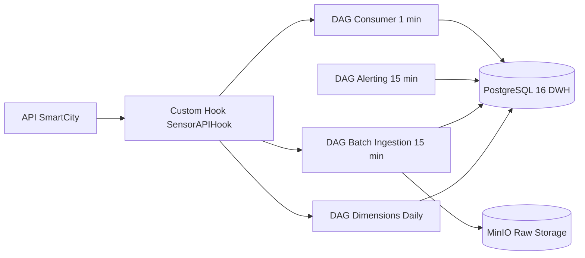

# SmartCity Airflow - Groupe 5

## Membres

- Frederic FERNANDES DA COSTA - Hook API commun - personne 1
- Ikhlas LAGHMICH - DAG dimensions - personne 2
- Narcisse Cabrel TSAFACK FOUEGAP - DAG batch ingestion - personne 3
- Maria MENNI - DAG alerting - personne 4
- Gills Daryl KETCHA NZOUNDJI JIEPMOU - DAG consumer - personne 5

## Objectif

Construire un projet SmartCity IoT orchestre avec Airflow 3.2.0, sans ressource cloud, avec ingestion batch, consumer minute, alerting, stockage TimescaleDB pour le DWH et MinIO pour le stockage objet.

## Contraintes techniques obligatoires

- Docker Compose uniquement
- Airflow 3.2.0 comme orchestrateur
- Python 3.12 pour tous les DAGs
- TimescaleDB 2.26.2 (PostgreSQL 18) pour le DWH time-series
- MinIO RELEASE.2025-09-07 pour le stockage objet compatible S3
- Grafana 13.0.0 pour les dashboards
- tests pytest avec au moins 3 tests qui passent
- idempotence obligatoire
- `catchup=False` et `max_active_runs=1` sur tous les DAGs de production

## Regles de travail

- `docker-compose.yaml` est la base officielle Airflow et ne doit pas etre modifie directement
- toute adaptation du groupe passe par `docker-compose.override.yaml`
- chaque membre travaille dans ses dossiers reserves
- les documents communs sont dans `docs/00-common/`
- les documents individuels sont dans leurs sous-dossiers dedies
- pas de credentials en dur dans le code
- pas de logique lourde au top-level des fichiers DAG
- les XCom doivent rester legers

## Architecture



## Arborescence du projet

```text
smartcity-airflow-groupe5/
|-- docker-compose.yaml
|-- docker-compose.override.yaml
|-- .env
|-- .env.example
|-- dags/
|   |-- ikhlas/
|   |-- narcisse/
|   |-- maria/
|   `-- gills/
|-- plugins/
|   |-- hooks/
|   `-- operators/
|-- sql/
|   |-- ikhlas/
|   |-- narcisse/
|   |-- maria/
|   `-- gills/
|-- tests/
|   |-- frederic/
|   |-- ikhlas/
|   |-- narcisse/
|   |-- maria/
|   `-- gills/
|-- docs/
|   |-- 00-common/
|   |-- 01-frederic-hook/
|   |-- 02-ikhlas-dimensions/
|   |-- 03-narcisse-batch-ingest/
|   |-- 04-maria-alerting/
|   `-- 05-gills-consumer/
`-- config/
```

## Instructions de lancement

```bash
cp .env.example .env
docker compose up -d
```

Interfaces disponibles apres demarrage (attendre 60s) :

| Service          | URL                       | Identifiants          |
|------------------|---------------------------|-----------------------|
| Airflow          | http://localhost:8080     | airflow / airflow     |
| Grafana          | http://localhost:3000     | admin / admin         |
| MinIO Console    | http://localhost:9001     | minio_admin / minio_password_2026 |
| Sensor Simulator | http://localhost:8000     | -                     |
| TimescaleDB      | localhost:5433            | smartcity_user / smartcity_password |

## DAGs et roles

- `smartcity_sensors_dims_refresh_daily` : rafraichissement des dimensions capteurs et stations, schedule `@daily`, responsable Ikhlas
- `smartcity_measurements_batch_ingest` : ingestion batch des mesures et chargement DWH, schedule `*/15 * * * *`, responsable Narcisse
- `smartcity_alert_check_batch` : detection des alertes sur les dernieres mesures, schedule `*/15 * * * *`, responsable Maria
- `smartcity_measurements_consumer_minutely` : consommation minute et micro-batch sans Kafka, schedule `*/1 * * * *`, responsable Gills

## Hook et composants custom

- `SensorAPIHook` : centraliser les appels vers l'API SmartCity, responsable Frederic

## Repartition des zones reservees

- Frederic : `plugins/hooks/`, `tests/frederic/`, `docs/01-frederic-hook/`
- Ikhlas : `dags/ikhlas/`, `sql/ikhlas/`, `tests/ikhlas/`, `docs/02-ikhlas-dimensions/`
- Narcisse : `dags/narcisse/`, `sql/narcisse/`, `tests/narcisse/`, `docs/03-narcisse-batch-ingest/`
- Maria : `dags/maria/`, `sql/maria/`, `tests/maria/`, `docs/04-maria-alerting/`
- Gills : `dags/gills/`, `sql/gills/`, `tests/gills/`, `docs/05-gills-consumer/`

## Tests

Commande cible :

```bash
docker compose exec airflow-worker pytest tests/ -v
```

Minimum attendu :

- au moins 3 tests qui passent
- test d'import des DAGs
- test du hook ou d'un composant custom
- test d'au moins un DAG metier

## Resultats attendus

- la stack Docker demarre avec `docker compose up -d`
- les DAGs apparaissent dans Airflow sans erreur d'import
- les donnees de reference sont chargees dans le DWH
- l'ingestion batch charge les mesures de maniere idempotente
- l'alerting ecrit les alertes attendues
- le consumer minute traite un micro-batch sans dupliquer les donnees
- MinIO contient les fichiers bruts si l'archivage est active

## Choix techniques

- Docker Compose est utilise pour respecter la contrainte locale du projet
- Airflow 3.2.0 (derniere version stable officielle)
- PostgreSQL 16 est retenu pour le DWH car il fait partie des contraintes communes
- MinIO est retenu pour fournir un stockage objet local compatible S3
- aucun usage de Kafka dans cette version du projet

## Grille d'evaluation

- Pipeline fonctionnel et idempotent : 25%
- Custom Hook ou Custom Operator : 20%
- Qualite du code : 20%
- Architecture et choix techniques justifies : 20%
- Documentation : 15%

## Commandes utiles

```bash
docker compose ps
docker compose logs airflow-dag-processor --tail=50
docker compose exec airflow-worker airflow dags list
docker compose exec airflow-worker pytest tests/ -v
```
