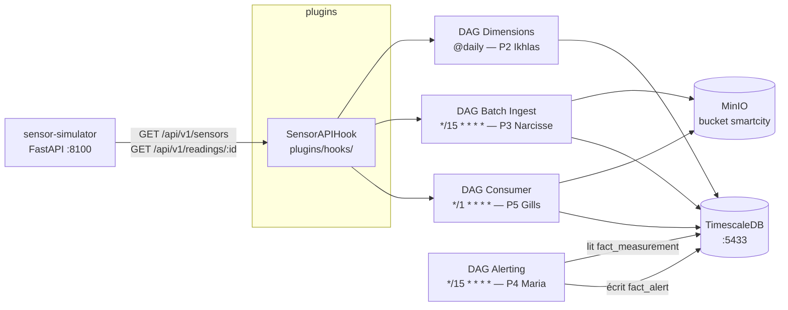

# SmartCity Airflow — Groupe 5

## Membres

| # | Nom | Responsabilité |
|---|-----|----------------|
| 1 | Frederic FERNANDES DA COSTA | Hook API commun (`SensorAPIHook`) |
| 2 | Ikhlas LAGHMICH | DAG dimensions quotidien |
| 3 | Narcisse Cabrel TSAFACK FOUEGAP | DAG batch ingestion 15 min |
| 4 | Maria MENNI | DAG alerting 15 min |
| 5 | Gills Daryl KETCHA NZOUNDJI JIEPMOU | DAG consumer 1 min |

## Objectif

Construire un projet SmartCity IoT orchestré avec Apache Airflow 3.2.0, sans ressource cloud, combinant ingestion batch, consumer temps réel (micro-batch), alerting par seuils, stockage TimescaleDB pour le DWH et MinIO pour le stockage objet brut.

## Stack technique

| Composant | Version | Rôle |
|-----------|---------|------|
| Apache Airflow | 3.2.0 | Orchestrateur (CeleryExecutor) |
| Python | 3.12 | Langage de tous les DAGs |
| TimescaleDB | 2.26.2 (PostgreSQL 18) | DWH time-series |
| MinIO | RELEASE.2025-09-07 | Stockage objet compatible S3 |
| Grafana | 13.0.0 | Dashboards |
| sensor-simulator | arnauropero/smart-cities-api | API REST FastAPI (données Barcelone) |

## Contraintes techniques obligatoires

- Docker Compose uniquement — aucune ressource cloud
- `catchup=False` et `max_active_runs=1` sur tous les DAGs de production
- Idempotence obligatoire (`ON CONFLICT DO NOTHING` / `ON CONFLICT DO UPDATE`)
- Pas de credentials en dur dans le code — tout passe par les connexions Airflow
- Pas de logique lourde au top-level des fichiers DAG (imports lazys dans les @task)
- XCom = références légères uniquement (chemin S3, compteur, statut)

## Règles de travail

- `docker-compose.yaml` est la base officielle Airflow — ne pas modifier directement
- Toute adaptation du groupe passe par `docker-compose.override.yaml`
- Chaque membre travaille dans ses dossiers réservés (voir section Répartition)
- Les documents communs sont dans `docs/00-common/`

## Architecture



## Arborescence du projet

```text
smartcity-airflow-groupe5/
├── docker-compose.yaml
├── docker-compose.override.yaml
├── config/
│   └── airflow.cfg
├── dags/
│   ├── smartcity_hook_health_check.py
│   ├── smartcity_sensors_dims_refresh_daily.py
│   ├── smartcity_measurements_batch_ingest.py
│   ├── smartcity_alert_check_batch.py
│   └── smartcity_measurements_consumer_minutely.py
├── plugins/
│   ├── hooks/
│   │   └── sensor_api_hook.py
│   └── operators/
├── sql/
│   ├── init/
│   │   ├── 01-schema.sql
│   │   ├── 02-seed.sql
│   │   ├── 03-hypertable.sql
│   │   └── 04-drop-fk.sql
│   ├── ikhlas/
│   ├── narcisse/
│   ├── maria/
│   └── gills/
├── tests/
│   ├── test_dag_import.py
│   ├── frederic/
│   ├── ikhlas/
│   ├── narcisse/
│   ├── maria/
│   └── gills/
└── docs/
    ├── 00-common/
    ├── 01-frederic-hook/
    ├── 02-ikhlas-dimensions/
    ├── 03-narcisse-batch-ingest/
    ├── 04-maria-alerting/
    └── 05-gills-consumer/
```

## Instructions de lancement

```bash
# 1. Copier les variables d'environnement
cp .env.example .env

# 2. Démarrer la stack complète
docker compose up -d

# 3. Attendre ~60 s que tous les services soient up
docker compose ps
```

Interfaces disponibles après démarrage :

| Service | URL | Identifiants |
|---------|-----|--------------|
| Airflow UI | http://localhost:8080 | airflow / airflow |
| Grafana | http://localhost:3000 | admin / admin |
| MinIO Console | http://localhost:9001 | minio_admin / minio_password_2026 |
| Sensor Simulator (API) | http://localhost:8100 | — |
| TimescaleDB | localhost:5433 | smartcity_user / smartcity_password |

### Connexions Airflow à créer (Admin → Connections)

| Conn Id | Type | Host | Port | Schema / Extra |
|---------|------|------|------|----------------|
| `sensor_api` | HTTP | `sensor-simulator` | `8000` | — |
| `smartcity_timescaledb` | Postgres | `timescaledb` | `5432` | `smartcity` |
| `minio_local` | Amazon S3 | — | — | `{"endpoint_url": "http://minio:9000", "region_name": "us-east-1"}` |

## DAGs

| DAG | Schedule | Responsable | Description |
|-----|----------|-------------|-------------|
| `smartcity_hook_health_check` | `@hourly` | Frederic | Valide que l API et le hook fonctionnent |
| `smartcity_sensors_dims_refresh_daily` | `@daily` | Ikhlas (P2) | Upsert `dim_location` + `dim_sensor` depuis l API |
| `smartcity_measurements_batch_ingest` | `*/15 * * * *` | Narcisse (P3) | Poll API → MinIO (brut) → TimescaleDB |
| `smartcity_alert_check_batch` | `*/15 * * * *` | Maria (P4) | Détection de seuils → `fact_alert` |
| `smartcity_measurements_consumer_minutely` | `*/1 * * * *` | Gills (P5) | Micro-batch API → MinIO → TimescaleDB |

## Hook commun

`SensorAPIHook` dans `plugins/hooks/sensor_api_hook.py` — étend `HttpHook` :

| Méthode | Endpoint | Retour |
|---------|----------|--------|
| `health_check()` | `GET /health` | `bool` |
| `get_sensors()` | `GET /api/v1/sensors` | `list[dict]` |
| `get_readings(sensor_id)` | `GET /api/v1/readings/{sensor_id}` | `list[dict]` |
| `get_metrics()` | `GET /api/v1/metrics` | `dict` |
| `get_metrics_summary()` | `GET /api/v1/metrics/summary` | `dict` |

## Répartition des zones réservées

| Membre | Fichiers réservés |
|--------|-------------------|
| Frederic | `plugins/hooks/`, `tests/frederic/`, `docs/01-frederic-hook/` |
| Ikhlas | `dags/smartcity_sensors_dims_refresh_daily.py`, `sql/ikhlas/`, `tests/ikhlas/`, `docs/02-ikhlas-dimensions/` |
| Narcisse | `dags/smartcity_measurements_batch_ingest.py`, `sql/narcisse/`, `tests/narcisse/`, `docs/03-narcisse-batch-ingest/` |
| Maria | `dags/smartcity_alert_check_batch.py`, `sql/maria/`, `tests/maria/`, `docs/04-maria-alerting/` |
| Gills | `dags/smartcity_measurements_consumer_minutely.py`, `sql/gills/`, `tests/gills/`, `docs/05-gills-consumer/` |

## Tests

```bash
# En local
python -m pytest tests/ -v

# Dans le conteneur Airflow
docker compose exec airflow-worker pytest tests/ -v
```

Résultats actuels : **70 passed, 1 skipped**

| Fichier | Tests | Scope |
|---------|-------|-------|
| `tests/frederic/test_sensor_api_hook.py` | 13 | Hook (health, get_sensors, get_readings, metrics) |
| `tests/ikhlas/test_smartcity_sensors_dims_refresh_daily.py` | 12 | Helper `_extract_district`, mapping champs |
| `tests/narcisse/test_smartcity_measurements_batch_ingest.py` | 11 | Filtre `_filter_valid_records`, normalisation sensor_id |
| `tests/maria/test_smartcity_alert_check_batch.py` | 21 | `_check_violation`, `THRESHOLDS`, logique detect |
| `tests/gills/test_smartcity_measurements_consumer_minutely.py` | 13 | poll_api, transform, flush |

## Résultats attendus

- La stack Docker démarre avec `docker compose up -d`
- Les 5 DAGs apparaissent dans Airflow sans erreur d import
- Les dimensions sont chargées dans `dim_location` / `dim_sensor` (P2)
- L ingestion batch charge les mesures de manière idempotente dans `fact_measurement` (P3)
- Les alertes sont écrites dans `fact_alert` lorsque les seuils sont dépassés (P4)
- Le consumer minute traite un micro-batch sans dupliquer les données (P5)
- MinIO `smartcity` contient les fichiers bruts (`raw/`) et batch (`batch/`)

## Feuille de route — Jalon 2 (J2)

Le Jalon 1 couvre l'intégralité de la pipeline via Airflow en micro-batch.  
Le Jalon 2 introduira un **vrai streaming avec Apache Kafka** :

| Composant | Version prévue | Rôle |
|-----------|----------------|------|
| Confluent Platform | 8.1.2 (KRaft) | Broker Kafka sans ZooKeeper |
| Kafka Connect | — | Connecteurs source / sink |
| DAG consumer Kafka | `*/1 * * * *` | Remplace le micro-batch P5 par un vrai consumer |

> Le DAG `smartcity_measurements_consumer_minutely` (P5) simule actuellement un consumer
> temps réel via micro-batch (poll API → MinIO → TimescaleDB).
> En J2, il sera remplacé par un consumer Kafka natif.
