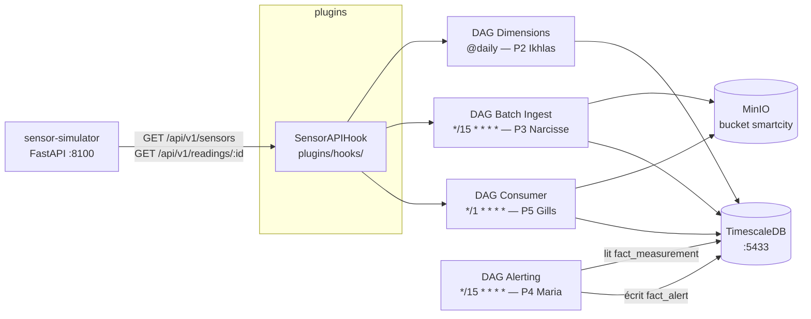
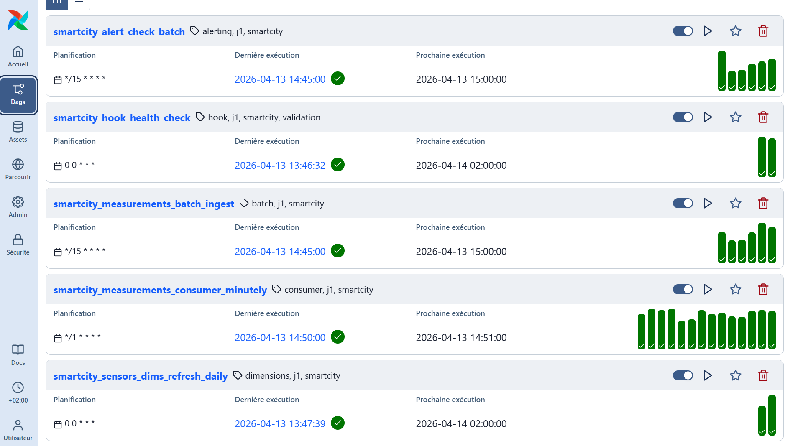
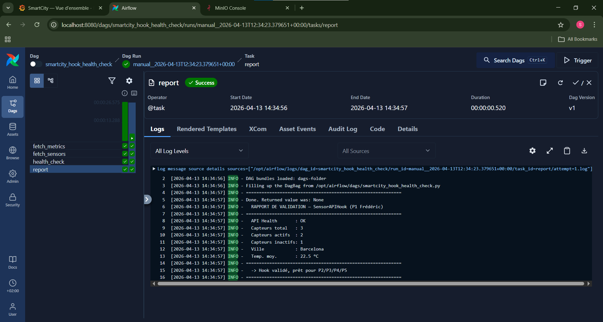
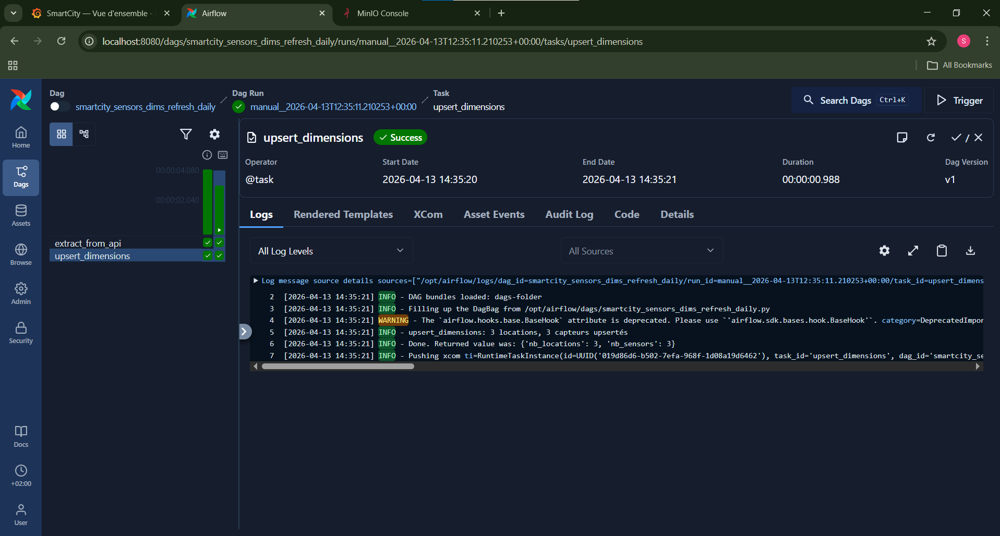
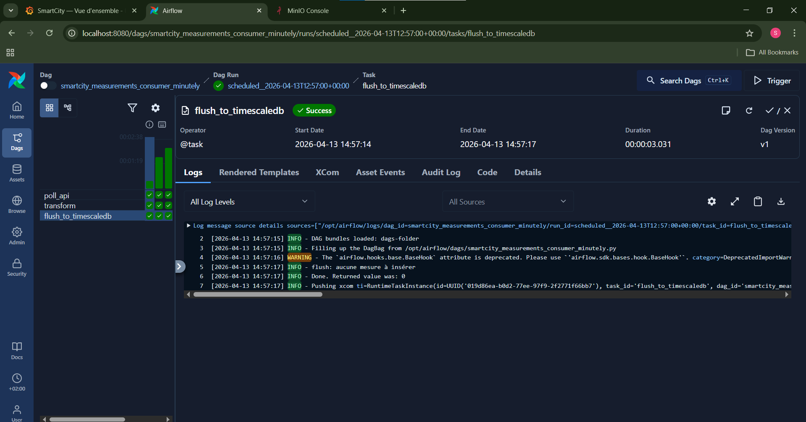
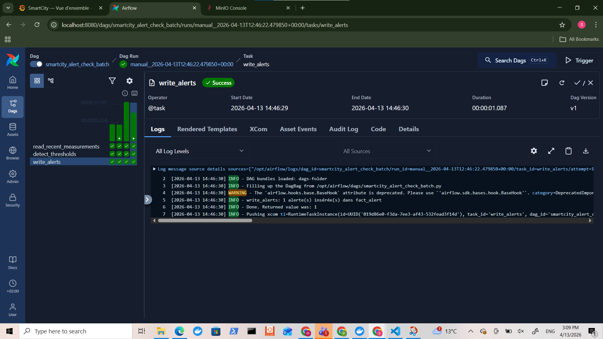
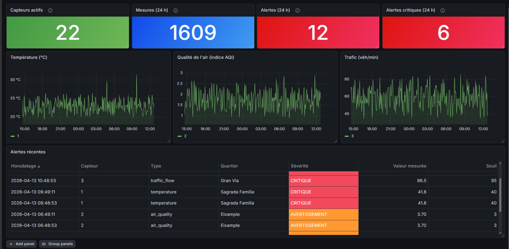
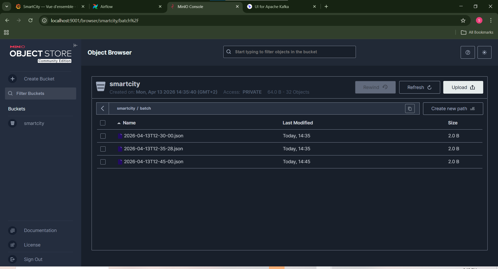

# SmartCity Airflow — Groupe 5

## Membres

| # | Nom | Responsabilité |
|---|-----|----------------|
| 1 | Frederic FERNANDES DA COSTA | Hook API commun  |
| 2 | Ikhlas LAGHMICH | DAG dimensions quotidien |
| 3 | Narcisse Cabrel TSAFACK FOUEGAP | DAG batch ingestion 15 min |
| 4 | Maria MENNI | DAG alerting 15 min |
| 5 | Gills Daryl KETCHA NZOUNDJI JIEPMOU | DAG consumer 1 min |

## Objectif

Ce projet implémente une plateforme SmartCity IoT orchestrée avec Apache Airflow, permettant de :

- Collecter des données de capteurs (API simulée)
- Traiter des données en batch et en quasi temps réel
- Détecter des anomalies
- Alimenter un Data Warehouse (PostgreSQL / TimescaleDB)
- Monitorer les flux de données

##  Stack technique

| Composant | Version | Rôle |
|-----------|---------|------|
| Apache Airflow | 3.2.0 | Orchestrateur de workflows (CeleryExecutor) |
| Python | 3.12 | Langage principal (DAGs, ETL, scripts) |
| PostgreSQL / TimescaleDB | PostgreSQL 18 + TimescaleDB 2.26.2 | Data Warehouse orienté séries temporelles |
| MinIO | RELEASE.2025-09-07 | Stockage objet compatible S3 |
| Grafana | 13.0.0 | Visualisation et dashboards |
| Sensor API (Simulator) | arnauropero/smart-cities-api | API REST FastAPI simulant des données IoT (Barcelone) |

## Architecture


## Arborescence du projet

```text
SmartCity/
│
├── api/                         
│   ├── app.py                  # API Flask exposant les données capteurs
│   ├── Dockerfile              # Image Docker de l’API
│   └── requirements.txt        # Dépendances Python API
│
├── sensor-simulator/           
│   ├── app.py                  # Générateur de données IoT simulées
│   ├── Dockerfile
│   └── requirements.txt
│
├── dags/                       
│   ├── smartcity_hook_health_check.py              # Test connexion API
│   ├── smartcity_measurements_batch_ingest.py      # Ingestion batch (15 min)
│   ├── smartcity_measurements_consumer_minutely.py # Consumer  (1 min)
│   ├── smartcity_alert_check_batch.py              # Détection d’anomalies
│   └── smartcity_sensors_dims_refresh_daily.py     # Mise à jour dimensions (daily)
│
├── plugins/                    
│   ├── hooks/                 # Hooks personnalisés (ex: SensorAPIHook)
│   └── operators/             # Operators custom Airflow
│
├── init-db/                   
│   ├── 01-extension.sql       # Extensions (ex: TimescaleDB)
│   ├── 02-schema.sql          # Création des tables
│   └── 03-seed.sql            # Données initiales
│
├── monitoring/                
│   └── ...                    # Dashboards / config Grafana
│
├── config/                    
│   └── airflow.cfg            # Configuration Airflow
│
├── logs/                      
│   └── dag_id=*/              # Logs d’exécution des DAGs
│
├── tests/                     
│   ├── conftest.py
│   ├── test_dag_import.py
│   ├── test_sensor_api_hook.py
│   ├── test_smartcity_measurements_batch_ingest.py
│   ├── test_smartcity_measurements_consumer_minutely.py
│   ├── test_smartcity_alert_check_batch.py
│   └── test_smartcity_sensors_dims_refresh_daily.py
│
├── docs/                      
│   ├── 00-common/             # Documentation globale
│   ├── 01-frederic-hook/
│   ├── 02-ikhlas-dimensions/
│   ├── 03-narcisse-batch-ingest/
│   ├── 04-maria-alerting/
│   └── 05-gills-consumer/
├── images/
├── .env.example               # Template de configuration
├── .gitignore
│
├── docker-compose.yaml        # Stack principale (Airflow, DB, API…)
├── docker-compose.override.yaml # Config locale complémentaire
├── docker-compose.kafka.yaml  # Extension Kafka (optionnel)
│
└── README.md                  # Documentation principale
```
##  Flux de données

1. Le `sensor-simulator` expose des données IoT via API REST
2. Le `SensorAPIHook` permet aux DAGs d’interroger l’API
3. Les DAGs Airflow traitent les données :
   - Batch → ingestion toutes les 15 minutes
   - Consumer → micro-batch toutes les 1 minute
   - Dimensions → mise à jour quotidienne
   - Alerting → détection d’anomalies
4. Les données sont :
   - Stockées en brut dans MinIO (`raw/`, `batch/`)
   - Transformées et insérées dans TimescaleDB (`fact_measurement`)
5. Les alertes sont générées dans `fact_alert`
6. Les dashboards Grafana permettent la visualisation

## Modèle de données

### Tables principales

| Table | Description |
|------|------------|
| `dim_location` | Informations géographiques des capteurs |
| `dim_sensor` | Métadonnées des capteurs |
| `fact_measurement` | Mesures collectées (time-series) |
| `fact_alert` | Alertes générées |

### Relations

- `fact_measurement.sensor_id → dim_sensor.id`
- `dim_sensor.location_id → dim_location.id`

##  DAGs implémentés

| DAG | Schedule | Responsable | Objectif | Fonctionnement | Stockage |
|-----|----------|-------------|----------|---------------|----------|
| `smartcity_hook_health_check` | `@hourly` | Frederic | Vérifier la disponibilité de l’API | Appel `/health` via `SensorAPIHook` | — |
| `smartcity_sensors_dims_refresh_daily` | `@daily` | Ikhlas | Mettre à jour les dimensions | Extraction API → transformation → upsert (`dim_sensor`, `dim_location`) | TimescaleDB |
| `smartcity_measurements_batch_ingest` | `*/15 * * * *` | Narcisse | Ingestion batch des mesures | Appel API → filtrage → insertion idempotente | MinIO + TimescaleDB |
| `smartcity_alert_check_batch` | `*/15 * * * *` | Maria | Détection des anomalies | Lecture `fact_measurement` → comparaison seuils → création alertes | TimescaleDB (`fact_alert`) |
| `smartcity_measurements_consumer_minutely` | `*/1 * * * *` | Gills | Traitement quasi temps réel | Poll API/ → micro-batch → insertion | MinIO + TimescaleDB |

##  Contraintes techniques

- Docker Compose uniquement (aucun cloud)
- `catchup=False` et `max_active_runs=1` sur tous les DAGs
- Idempotence obligatoire (`ON CONFLICT DO NOTHING / UPDATE`)
- Pas de credentials en dur (utiliser Airflow Connections)
- Pas de logique lourde au top-level des DAGs
- XCom limité à des données légères

##  Sécurité & bonnes pratiques

- Utilisation des connexions Airflow pour les accès externes
- Isolation des services via Docker
- Gestion des erreurs API via le hook personnalisé
- Aucun secret stocké en clair dans le code
- Séparation claire entre ingestion, transformation et stockage

##  Gestion des erreurs

- Retry automatique configuré sur les DAGs
- Logs disponibles dans le dossier `logs/`
- Validation des données avant insertion
- Gestion des erreurs API via `SensorAPIHook`
- Pipeline idempotent pour éviter les doublons

##  Performances

- Batch : ingestion toutes les 15 minutes
- Streaming : micro-batch toutes les 1 minute
- Latence respectée :
  - Batch < 15 min
  - Streaming < 2 min
- Utilisation de TimescaleDB (hypertable) pour optimiser les requêtes temporelles

## Screenshots & Résultats

### Airflow UI


### Exécution DAG
#### Vérification du Hook


####  Mise à jour des dimensions


#### Consumer temps réel 


#### Alerting


### Grafana Dashboard


- Visualisation des données en temps réel :
  - Nombre de capteurs actifs
  - Mesures (24h)
  - Alertes
- Graphiques :
  - Température
  - Qualité de l’air (AQI)
  - Trafic
- Tableau des alertes récentes avec niveau de sévérité

### MinIO



## Instructions de lancement

```bash
# 1. Copier les variables d'environnement
cp .env.example .env

# 2. Démarrer la stack complète
docker compose up -d

# 3. Attendre ~60 s que tous les services soient up
docker compose ps
```

Interfaces disponibles après démarrage :

| Service | URL | Identifiants |
|---------|-----|--------------|
| Airflow UI | http://localhost:8080 | airflow / airflow |
| Grafana | http://localhost:3000 | admin / admin |
| MinIO Console | http://localhost:9001 | minio_admin / minio_password_2026 |
| Sensor Simulator (API) | http://localhost:8100 | — |
| TimescaleDB | localhost:5433 | smartcity_user / smartcity_password |

### Connexions Airflow à créer (Admin → Connections)

| Conn Id | Type | Host | Port | Schema / Extra |
|---------|------|------|------|----------------|
| `sensor_api` | HTTP | `sensor-simulator` | `8000` | — |
| `smartcity_timescaledb` | Postgres | `timescaledb` | `5432` | `smartcity` |
| `minio_local` | Amazon S3 | — | — | `{"endpoint_url": "http://minio:9000", "region_name": "us-east-1"}` |

## Tests

```bash
# En local
python -m pytest tests/ -v

# Dans le conteneur Airflow
docker compose exec airflow-worker pytest tests/ -v
```

Résultats actuels : **70 passed, 1 skipped**

| Fichier | Tests | Scope |
|---------|-------|-------|
| `tests/frederic/test_sensor_api_hook.py` | 13 | Hook (health, get_sensors, get_readings, metrics) |
| `tests/ikhlas/test_smartcity_sensors_dims_refresh_daily.py` | 12 | Helper `_extract_district`, mapping champs |
| `tests/narcisse/test_smartcity_measurements_batch_ingest.py` | 11 | Filtre `_filter_valid_records`, normalisation sensor_id |
| `tests/maria/test_smartcity_alert_check_batch.py` | 21 | `_check_violation`, `THRESHOLDS`, logique detect |
| `tests/gills/test_smartcity_measurements_consumer_minutely.py` | 13 | poll_api, transform, flush |


