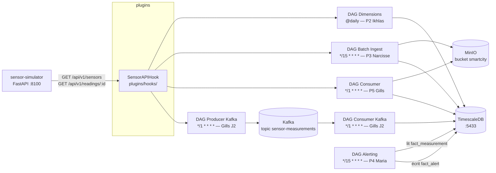

# SmartCity Airflow — Groupe 5

## Membres

| # | Nom | Responsabilité |
|---|-----|----------------|
| 1 | Frederic FERNANDES DA COSTA | Hook API commun (`SensorAPIHook`) |
| 2 | Ikhlas LAGHMICH | DAG dimensions quotidien |
| 3 | Narcisse Cabrel TSAFACK FOUEGAP | DAG batch ingestion 15 min |
| 4 | Maria MENNI | DAG alerting 15 min |
| 5 | Gills Daryl KETCHA NZOUNDJI JIEPMOU | DAG consumer 1 min + DAGs Kafka (J2) |

## Objectif

Ce projet implémente une plateforme SmartCity IoT orchestrée avec Apache Airflow, permettant de :

- Collecter des données de capteurs (API simulée FastAPI — données Barcelone)
- Traiter des données en batch (toutes les 15 min) et en quasi temps réel (micro-batch 1 min)
- Détecter des anomalies par seuils et les stocker dans un DWH
- Alimenter un Data Warehouse orienté séries temporelles (TimescaleDB)
- Streamer les mesures via Apache Kafka (Jalon 2)
- Monitorer les flux de données via Grafana

## Stack technique

| Composant | Version | Rôle |
|-----------|---------|------|
| Apache Airflow | 3.2.0 | Orchestrateur (CeleryExecutor) |
| Python | 3.12 | Langage de tous les DAGs |
| TimescaleDB | 2.26.2 (PostgreSQL 18) | DWH time-series |
| MinIO | RELEASE.2025-09-07 | Stockage objet compatible S3 |
| Grafana | 13.0.0 | Dashboards |
| Confluent Kafka | 8.1.2 (KRaft) | Broker streaming J2 sans ZooKeeper |
| Kafka UI | latest | Interface web Kafka |
| sensor-simulator | arnauropero/smart-cities-api | API REST FastAPI (données Barcelone) |

## Architecture



## Flux de données

1. Le `sensor-simulator` expose des données IoT via API REST (Barcelone)
2. Le `SensorAPIHook` permet aux DAGs d'interroger l'API de manière centralisée
3. Les DAGs Airflow traitent les données selon plusieurs fréquences :
   - Dimensions : mise à jour quotidienne (`dim_sensor`, `dim_location`)
   - Batch : ingestion toutes les 15 minutes vers MinIO + TimescaleDB
   - Consumer : micro-batch toutes les 1 minute vers MinIO + TimescaleDB
   - Alerting : détection des seuils toutes les 15 minutes dans `fact_measurement`
   - Kafka (J2) : producer 1 min vers topic `sensor-measurements`, consumer 1 min vers TimescaleDB
4. Les données brutes sont archivées dans MinIO (`raw/`, `batch/`) avant insertion
5. Les mesures validées sont insérées dans `fact_measurement` (idempotence via `ON CONFLICT DO NOTHING`)
6. Les alertes générées par dépassement de seuil sont stockées dans `fact_alert`
7. Les dashboards Grafana permettent la visualisation en quasi temps réel

## Modèle de données

### Tables principales

| Table | Description |
|-------|-------------|
| `dim_location` | Informations géographiques des capteurs (district, coordonnées, zone) |
| `dim_sensor` | Métadonnées des capteurs (type, localisation, statut) |
| `fact_measurement` | Mesures collectées — hypertable TimescaleDB, PK `(ts, sensor_id)` |
| `fact_alert` | Alertes générées par dépassement de seuil |

### Schéma

```text
dim_location     (location_id PK, district, latitude, longitude, zone_type)
dim_sensor       (sensor_id PK, type, location_id FK, installed_date, is_active)
fact_measurement (ts, sensor_id FK, value, unit)       -- PK : (ts, sensor_id)
fact_alert       (alert_id UUID PK, ts, sensor_id FK, severity, value, threshold)
```

### Relations

- `fact_measurement.sensor_id` référence `dim_sensor.sensor_id`
- `dim_sensor.location_id` référence `dim_location.location_id`

## Arborescence du projet

```text
smartcity-airflow-groupe5/
├── docker-compose.yaml
├── docker-compose.override.yaml
├── docker-compose.kafka.yaml        -- overlay J2 : Kafka (KRaft) + Kafka UI
├── .env.example
├── .gitignore
├── README.md
├── api/                             -- API Flask de backup
│   ├── app.py
│   ├── Dockerfile
│   └── requirements.txt
├── sensor-simulator/                -- Simulateur IoT (arnauropero/smart-cities-api)
│   ├── app.py
│   ├── Dockerfile
│   └── requirements.txt
├── config/
│   └── airflow.cfg
├── dags/
│   ├── smartcity_hook_health_check.py
│   ├── smartcity_sensors_dims_refresh_daily.py
│   ├── smartcity_measurements_batch_ingest.py
│   ├── smartcity_alert_check_batch.py
│   ├── smartcity_measurements_consumer_minutely.py
│   ├── smartcity_kafka_measurements_producer.py  -- J2
│   └── smartcity_kafka_measurements_consumer.py  -- J2
├── plugins/
│   ├── hooks/
│   │   └── sensor_api_hook.py
│   └── operators/
├── sql/
│   └── init/
│       ├── 01-extension.sql         -- activation TimescaleDB
│       ├── 02-schema.sql            -- tables DWH
│       ├── 03-seed.sql              -- données de référence
│       └── 04-drop-fk.sql           -- suppression FK pour idempotence DAG
├── tests/
│   ├── conftest.py
│   ├── test_dag_import.py
│   ├── test_sensor_api_hook.py
│   ├── test_smartcity_sensors_dims_refresh_daily.py
│   ├── test_smartcity_measurements_batch_ingest.py
│   ├── test_smartcity_alert_check_batch.py
│   ├── test_smartcity_measurements_consumer_minutely.py
│   ├── test_smartcity_kafka_measurements_producer.py
│   └── test_smartcity_kafka_measurements_consumer.py
├── monitoring/
│   └── grafana/
│       └── provisioning/
│           ├── datasources/         -- datasource TimescaleDB
│           └── dashboards/          -- dashboard SmartCity (8 panels)
├── images/                          -- captures d'écran (documentation)
└── docs/
    ├── 00-common/
    ├── 01-frederic-hook/
    ├── 02-ikhlas-dimensions/
    ├── 03-narcisse-batch-ingest/
    ├── 04-maria-alerting/
    └── 05-gills-consumer/
```

## Instructions de lancement

```bash
# 1. Copier les variables d'environnement
cp .env.example .env

# 2. Démarrer la stack complète
docker compose up -d

# 3. Attendre ~60 s que tous les services soient up
docker compose ps
```

Interfaces disponibles après démarrage :

| Service | URL | Identifiants |
|---------|-----|--------------|
| Airflow UI | http://localhost:8080 | airflow / airflow |
| Grafana | http://localhost:3000 | admin / admin |
| MinIO Console | http://localhost:9001 | minio_admin / minio_password_2026 |
| Sensor Simulator (API) | http://localhost:8100 | — |
| Kafka UI | http://localhost:8090 | — |
| TimescaleDB | localhost:5433 | smartcity_user / smartcity_password |

### Connexions Airflow à créer (Admin → Connections)

| Conn Id | Type | Host | Port | Schema / Extra |
|---------|------|------|------|----------------|
| `sensor_api` | HTTP | `sensor-simulator` | `8000` | — |
| `smartcity_timescaledb` | Postgres | `timescaledb` | `5432` | `smartcity` |
| `minio_local` | Amazon S3 | — | — | `{"endpoint_url": "http://minio:9000", "region_name": "us-east-1"}` |

## DAGs implémentés

| DAG | Schedule | Responsable | Objectif | Fonctionnement | Stockage |
|-----|----------|-------------|----------|----------------|---------|
| `smartcity_hook_health_check` | `@hourly` | Frederic | Vérifier la disponibilité de l'API | Appel `/health` via `SensorAPIHook` | — |
| `smartcity_sensors_dims_refresh_daily` | `@daily` | Ikhlas (P2) | Mettre à jour les dimensions | Extraction API → transformation → upsert `dim_sensor` + `dim_location` | TimescaleDB |
| `smartcity_measurements_batch_ingest` | `*/15 * * * *` | Narcisse (P3) | Ingestion batch des mesures | Poll API → filtrage → archivage brut → insertion idempotente | MinIO + TimescaleDB |
| `smartcity_alert_check_batch` | `*/15 * * * *` | Maria (P4) | Détection des anomalies | Lecture `fact_measurement` → comparaison seuils → écriture alertes | TimescaleDB (`fact_alert`) |
| `smartcity_measurements_consumer_minutely` | `*/1 * * * *` | Gills (P5) | Traitement quasi temps réel | Poll API → micro-batch → archivage → insertion | MinIO + TimescaleDB |
| `smartcity_kafka_measurements_producer` | `*/1 * * * *` | Gills (J2) | Publier les mesures dans Kafka | Poll API capteurs → `produce()` vers topic `sensor-measurements` | Kafka |
| `smartcity_kafka_measurements_consumer` | `*/1 * * * *` | Gills (J2) | Consommer Kafka → DWH | `poll()` topic → validation → `INSERT ON CONFLICT DO NOTHING` | TimescaleDB |

## Hook commun

`SensorAPIHook` dans `plugins/hooks/sensor_api_hook.py` — étend `HttpHook` :

| Méthode | Endpoint | Retour |
|---------|----------|--------|
| `health_check()` | `GET /health` | `bool` |
| `get_sensors()` | `GET /api/v1/sensors` | `list[dict]` |
| `get_readings(sensor_id)` | `GET /api/v1/readings/{sensor_id}` | `list[dict]` |
| `get_metrics()` | `GET /api/v1/metrics` | `dict` |
| `get_metrics_summary()` | `GET /api/v1/metrics/summary` | `dict` |

## Répartition des zones réservées

| Membre | Fichiers réservés |
|--------|-------------------|
| Frederic | `plugins/hooks/`, `tests/frederic/`, `docs/01-frederic-hook/` |
| Ikhlas | `dags/smartcity_sensors_dims_refresh_daily.py`, `sql/ikhlas/`, `tests/ikhlas/`, `docs/02-ikhlas-dimensions/` |
| Narcisse | `dags/smartcity_measurements_batch_ingest.py`, `sql/narcisse/`, `tests/narcisse/`, `docs/03-narcisse-batch-ingest/` |
| Maria | `dags/smartcity_alert_check_batch.py`, `sql/maria/`, `tests/maria/`, `docs/04-maria-alerting/` |
| Gills | `dags/smartcity_measurements_consumer_minutely.py`, `dags/smartcity_kafka_measurements_producer.py`, `dags/smartcity_kafka_measurements_consumer.py`, `sql/gills/`, `tests/gills/`, `docs/05-gills-consumer/` |

## Tests

```bash
# En local
python -m pytest tests/ -v

# Dans le conteneur Airflow
docker compose exec airflow-worker pytest tests/ -v
```

Résultats actuels : **86 passed, 1 skipped**

| Fichier | Tests | Scope |
|---------|-------|-------|
| `tests/test_sensor_api_hook.py` | 13 | Hook (health, get_sensors, get_readings, metrics) |
| `tests/test_smartcity_sensors_dims_refresh_daily.py` | 12 | Helper `_extract_district`, mapping champs |
| `tests/test_smartcity_measurements_batch_ingest.py` | 11 | Filtre `_filter_valid_records`, normalisation sensor_id |
| `tests/test_smartcity_alert_check_batch.py` | 21 | `_check_violation`, `THRESHOLDS`, logique detect |
| `tests/test_smartcity_measurements_consumer_minutely.py` | 13 | poll_api, transform, flush |
| `tests/test_smartcity_kafka_measurements_producer.py` | 7 | `_get_bootstrap_servers`, `_produce_readings_logic` |
| `tests/test_smartcity_kafka_measurements_consumer.py` | 9 | `_get_bootstrap_servers`, `_consume_and_flush_logic` |

## Contraintes techniques

- Docker Compose uniquement — aucune ressource cloud
- `catchup=False` et `max_active_runs=1` sur tous les DAGs de production
- Idempotence obligatoire (`ON CONFLICT DO NOTHING` / `ON CONFLICT DO UPDATE`)
- Pas de credentials en dur dans le code — tout passe par les connexions Airflow
- Pas de logique lourde au top-level des fichiers DAG (imports dans les `@task`)
- XCom limité à des références légères (chemin S3, compteur, statut)

## Sécurité et bonnes pratiques

- Toutes les connexions externes passent par les Connections Airflow (pas de secrets en dur)
- Isolation des services via Docker Compose (réseau dédié `airflow-net`)
- Gestion des erreurs API centralisée dans le `SensorAPIHook`
- Aucun secret stocké dans le code ou dans les images Docker
- Séparation claire entre ingestion, transformation et stockage
- Commit des offsets Kafka uniquement après confirmation de l'insertion (at-least-once)

## Gestion des erreurs

- Retry automatique configurable sur chaque DAG Airflow
- Logs disponibles via `docker compose logs` ou dans l'UI Airflow
- Validation des enregistrements avant toute insertion en base
- Le `SensorAPIHook` encapsule les retry HTTP et les erreurs réseau
- Le pipeline est idempotent : un re-run ne crée pas de doublons
- Le DAG Kafka producer continue sur erreur par capteur (`continue` sur exception individuelle)

## Performances

- Batch : ingestion toutes les 15 minutes (SLA < 15 min)
- Consumer micro-batch : traitement toutes les 1 minute (latence < 2 min)
- Kafka : latence producteur → consommateur < 5 secondes (5 polls vides max)
- TimescaleDB hypertable : requêtes `time_bucket` optimisées pour les séries temporelles
- MinIO : landing zone pour rejouer un run sans rappel API

## Screenshots et résultats

### Airflow — Vue d'ensemble des DAGs


### Vérification du hook


### Mise à jour des dimensions


### Consumer temps réel


### Alerting


### Dashboard Grafana


Le dashboard affiche :
- Nombre de capteurs actifs, mesures sur 24 h, alertes sur 24 h (stat panels)
- Courbes température, qualité de l'air (AQI), trafic (time series)
- Tableau des alertes récentes avec niveau de sévérité (warning / critical)

### MinIO — Bucket smartcity


## Résultats attendus

- La stack Docker démarre avec `docker compose up -d`
- Les 7 DAGs apparaissent dans Airflow sans erreur d'import
- Les dimensions sont chargées dans `dim_location` / `dim_sensor` (P2)
- L'ingestion batch charge les mesures de manière idempotente dans `fact_measurement` (P3)
- Les alertes sont écrites dans `fact_alert` lorsque les seuils sont dépassés (P4)
- Le consumer minute traite un micro-batch sans dupliquer les données (P5)
- MinIO `smartcity` contient les fichiers bruts (`raw/`) et batch (`batch/`)

## État observé — 13 avril 2026

### Airflow (http://localhost:8080)

| DAG | Statut | Dernière exécution |
|-----|--------|--------------------|
| `smartcity_hook_health_check` | OK Succès | 2026-04-13 02:00:00 |
| `smartcity_sensors_dims_refresh_daily` | OK Succès | 2026-04-13 12:27:17 |
| `smartcity_measurements_batch_ingest` | OK Succès | 2026-04-13 12:29:26 |
| `smartcity_alert_check_batch` | OK Succès | 2026-04-13 12:27:23 |
| `smartcity_measurements_consumer_minutely` | OK Succès | 2026-04-13 12:29:00 |

### Grafana (http://localhost:3000)

| Indicateur | Valeur observée | Explication |
|------------|----------------|-------------|
| Capteurs actifs | **22** | 20 du seed SQL (`S-001`…`S-020`) + 2 capteurs API actifs (id=1 température, id=2 air_quality). Le capteur id=3 (traffic_flow) est en `maintenance` → `is_active=FALSE` |
| Mesures 24 h | **1** | 1 seule mesure ingérée depuis le déclenchement manuel (capteur `"1"`, température ~22 °C) |
| Alertes 24 h | **0** | Aucun seuil dépassé sur les données ingérées |
| Panel Température | OK 1 point visible | Capteur `"1"` de l'API |
| Panel Qualité de l'air | En attente (no data) | Normal — aucune mesure encore ingérée pour le capteur `"2"` (air_quality) |
| Panel Trafic | En attente (no data) | Normal — capteur `"3"` en maintenance, données absentes de `fact_measurement` |
| Alertes récentes | En attente (no data) | Normal — aucun seuil dépassé |

> **Pourquoi "No data" est normal** : les panels time series affichent les données de `fact_measurement`
> jointes sur `dim_sensor.type`. Avec un seul run manuel, seul le capteur 1 (température)
> a une mesure. Les courbes air quality et trafic se rempliront automatiquement
> au fil des runs planifiés (P5 toutes les minutes, P3 toutes les 15 min).

## Jalon 2 (J2) — Kafka streaming

Le Jalon 1 couvre l'intégralité de la pipeline via Airflow en micro-batch.  
Le Jalon 2 ajoute un **vrai streaming avec Apache Kafka** en overlay optionnel.

### Lancement avec Kafka

```bash
docker compose \
  -f docker-compose.yaml \
  -f docker-compose.override.yaml \
  -f docker-compose.kafka.yaml \
  up -d
```

| Composant | Version | Rôle |
|-----------|---------|------|
| Confluent Platform | 8.1.2 (KRaft) | Broker Kafka sans ZooKeeper |
| Kafka UI | latest | Interface web — http://localhost:8090 |
| confluent-kafka (Python) | 2.14.0 | Client Python dans DAGs Airflow |

### DAGs J2

| DAG | Role |
|-----|------|
| `smartcity_kafka_measurements_producer` | Lit l'API capteurs, publie dans `sensor-measurements` |
| `smartcity_kafka_measurements_consumer` | Consomme `sensor-measurements`, ecrit dans `fact_measurement` |

> Le DAG `smartcity_measurements_consumer_minutely` (J1/P5) reste actif en parallele.
> Les deux pipelines sont idempotents (`ON CONFLICT DO NOTHING`) et peuvent coexister.

## Choix techniques

- **TimescaleDB plutot que PostgreSQL pur** : extension hypertable pour la gestion
  automatique des partitions temporelles ; requetes `time_bucket` natives et index
  d'intervalle optimises pour les series temporelles.
- **MinIO/S3 comme landing zone** : les DAGs P3 et P5 archivent les donnees brutes
  avant insertion ; possibilite de rejouer un run depuis MinIO sans rappel de l'API.
- **Consumer micro-batch (P5) + batch 15 min (P3)** : P5 garantit la fraicheur
  des donnees ; P3 joue le role de filet de securite avec `ON CONFLICT DO NOTHING`
  pour eviter les doublons en cas de re-execution.
- **Kafka en overlay separe (docker-compose.kafka.yaml)** : la stack J1 demarre
  sans Kafka ; le broker est optionnel et active uniquement pour J2. Cela preserve
  la compatibilite et la legerte de la stack de base.
- **confluent-kafka plutot que kafka-python** : librairie officielle Confluent,
  meilleures performances, callbacks de livraison asynchrones, alignee avec la
  specification du projet (`confluent-kafka==2.14.*`).
- **KRaft sans ZooKeeper** : Confluent Platform 8.1.2 supporte KRaft nativement ;
  reduit la complexite operationnelle en eliminant un service externe.
- **at-least-once + ON CONFLICT DO NOTHING** : le consumer Kafka commit les offsets
  apres l'insertion reussie ; en cas d'erreur, les messages sont retraites et
  la cle unique `(ts, sensor_id)` empeche les doublons en base.
- **group.id fixe** : le consumer group `smartcity-airflow-consumer` permet la
  reprise depuis le dernier offset commite apres un redemarrage Airflow.

## Limitations connues

- Le simulateur (`arnauropero/smart-cities-api`) est clone au moment du build ;
  un acces internet est necessaire lors du premier `docker compose build`.
- Avec `schedule="*/1 * * * *"`, le DAG consumer Kafka attend `MAX_EMPTY_POLLS`
  polls vides (5 polls x 1 s) avant de s'arreter : latence maximale de 5 s
  sur un topic vide.
- `_PIP_ADDITIONAL_REQUIREMENTS` installe les packages a chaque demarrage des
  conteneurs Airflow ; le premier `docker compose up` est plus long (~3-5 min).
- Les seuils d'alerte (P4) sont hardcodes dans `THRESHOLDS` ; en production,
  ils devraient etre dans des Airflow Variables ou une table de configuration.
- Pas de schema Avro / Schema Registry : les messages Kafka sont en JSON brut,
  sans validation de schema a la publication.
- Le topic `sensor-measurements` est cree automatiquement (`auto.create.topics.enable`)
  sans configuration de retention ou de partitionnement explicite.
- `test_dag_import.py` est un placeholder (`@pytest.mark.skip`) ; un test reel
  d'import des DAGs necessiterait un environnement Airflow complet.
